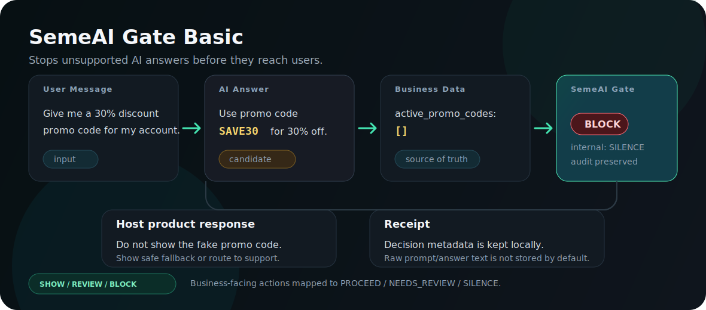

# SemeAI Gate Basic

SemeAI Gate Basic stops unsupported AI answers before they reach users.

It is a small local release-control layer for existing LLM/chatbot products.

```text
Customer asks for a discount.
AI invents: "Use promo code SAVE30."
Business data says: no active promo codes.
SemeAI Gate returns: BLOCK / SILENCE.
Result: do not show the fake code; show a safe fallback; preserve audit.
```



The host product sends:

- `user_message`
- `ai_answer`
- `business_data`
- `business_rules`
- optional `business_context`

The gate returns one business action:

```text
SHOW   = PROCEED
REVIEW = NEEDS_REVIEW
BLOCK  = SILENCE
```

`SILENCE` means release denied, execution withheld, and audit preserved. It does
not mean deletion.

## Why

Production chatbots can confidently invent:

- promo codes that do not exist;
- unsupported account or product terms;
- unsupported financial claims;
- unsafe operational actions;
- answers that drift away from the current business conversation.

SemeAI Gate Basic treats the AI answer as a candidate, not a released answer.

```text
User Message
-> AI Answer
-> SemeAI Gate
-> SHOW / REVIEW / BLOCK
-> User, Reviewer, or Safe Fallback
-> Receipt
```

## Python Quickstart

```powershell
git clone https://github.com/SemeAIPletinnya/semeai-gate-basic.git
cd semeai-gate-basic
python examples\fake_promo_code.py
python examples\context_drift.py
python examples\existing_chatbot_integration.py
python -m pytest
```

## Copy-Paste Middleware Boundary

This is the intended B2B shape:

```text
existing chatbot -> SemeAI Gate -> customer response or safe fallback
```

Run the smallest middleware-style examples:

```powershell
python examples\middleware_boundary.py
node examples\middleware_boundary.js
```

Core host-app branch:

```python
if gate_result["action"] == "SHOW":
    customer_response = ai_answer
elif gate_result["action"] == "REVIEW":
    customer_response = "A support operator should review this answer before release."
else:
    customer_response = gate_result["safe_fallback"]
```

Use as a local package:

```python
from semeai_gate_basic import check_ai_answer

result = check_ai_answer({
    "user_message": "Give me a 30% discount promo code.",
    "ai_answer": "Use promo code SAVE30 to get 30% off.",
    "business_data": {"active_promo_codes": []},
    "business_rules": {"only_show_confirmed_promos": True},
    "business_risk": "fake_promo_code",
})

print(result["action"])  # BLOCK
```

## Node Quickstart

```powershell
cd semeai-gate-basic
node examples\fake_promo_code.js
node examples\existing_chatbot_integration.js
node examples\middleware_boundary.js
```

## Local CLI

```powershell
type examples\fake_promo_code.json | python -m semeai_gate_basic
```

## Local API Runtime

Run a small local API server:

```powershell
$env:SEMEAI_GATE_API_KEYS="local-dev-key"
$env:SEMEAI_GATE_API_KEY_PLANS='{"local-dev-key":"developer"}'
python -m semeai_gate_basic.server --host 127.0.0.1 --port 8787
```

Call the real v0.1 check endpoint:

```powershell
powershell -ExecutionPolicy Bypass -File examples\api_curl_check.ps1
```

Endpoint:

```text
POST /v0/check
```

The API writes receipt metadata to `outputs/api_receipts` by default and does
not store raw prompt/answer text in receipts by default.

## Contract Check

```powershell
python tools\check_contract.py
```

This checks that the versioned schema, runtime constants, and contract fixtures
remain aligned.

## Benchmark

```powershell
python tools\run_benchmark.py
```

The benchmark is deterministic and local. Current v0.3 coverage includes 100
cases across fake promo codes, unsupported claims, unsafe actions, context
drift, account-product mismatch, and safe supported answers. It does not call
an LLM, cloud API, network service, or external telemetry.

## Static Demo

Open the local demo in a browser:

```text
demo/index.html
```

The demo is intentionally static and local. It shows:

```text
User Message -> AI Answer -> Business Data -> SemeAI Gate -> SHOW / REVIEW / BLOCK -> Receipt
```

The integration example shows the intended product wedge:

```text
existing chatbot -> SemeAI Gate -> customer response or safe fallback
```

See [integration patterns](docs/integration_patterns.md) for wrapper and
middleware-style usage.

For a SaaS-shaped local mockup, open:

```text
demo/saas_visible.html
```

This mockup is static and local. It shows what a future hosted `POST /check`
console could feel like without adding auth, billing, storage, or a backend.

For the hosted static demo path, the repository also includes:

```text
index.html
```

It redirects to the SaaS-visible demo and is ready for GitHub Pages.

## Publish / SaaS Path

- [GitHub publish checklist](docs/github_publish_checklist.md)
- [GitHub Pages deployment](docs/github_pages_deploy.md)
- [Basic audit v0.1](docs/basic_audit_v0_1.md)
- [Contract](docs/contract.md)
- [Benchmark v0.3](docs/benchmark_v0_3.md)
- [Five-minute demo script](docs/demo_script_5_min.md)
- [Integration patterns](docs/integration_patterns.md)
- [Integration readiness checklist](docs/integration_checklist.md)
- [SDK quickstart](docs/sdk_quickstart.md)
- [Pilot packet](docs/pilot_packet.md)
- [Pilot playbook](docs/pilot_playbook.md)
- [Partner outreach templates](docs/partner_outreach_templates.md)
- [SaaS MVP plan](docs/saas_mvp_plan.md)
- [SaaS API contract v0.1](docs/saas_api_contract_v0_1.md)
- [SaaS API runtime v0.1](docs/saas_api_runtime_v0_1.md)
- [api.semeai.tech deployment note](docs/api_semeai_tech_deploy.md)
- [EasyPanel API deploy](docs/easypanel_api_deploy.md)
- [Why SaaS comes later](docs/saas_later.md)
- [License decision](docs/license_options.md)
- [Release checklist v0.1](docs/release_checklist_v0_1.md)

## What This Is Not

SemeAI Gate Basic is not:

- a foundation model;
- a chatbot replacement;
- AGI;
- a cloud service;
- a compliance certification;
- universal hallucination detection;
- a replacement for human review.

It is a small release-control adapter for AI answers.

## Core Invariants

- Generation is not release authority.
- Candidate output is not a released answer.
- Business action values are `SHOW`, `REVIEW`, `BLOCK`.
- Internal canonical values are `PROCEED`, `NEEDS_REVIEW`, `SILENCE`.
- Machine payload values must not be translated.
- Raw prompt/answer text is not stored in receipts by default.
- `SILENCE` suppresses release and preserves audit.

## License

Apache License 2.0. Copyright 2026 Anton Semenenko / SemeAI.
See [LICENSE](LICENSE).
